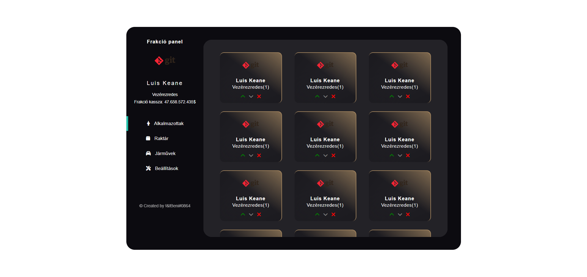
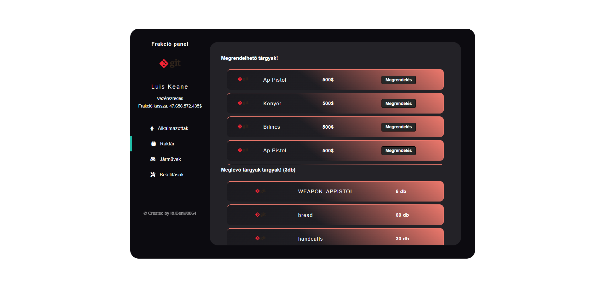
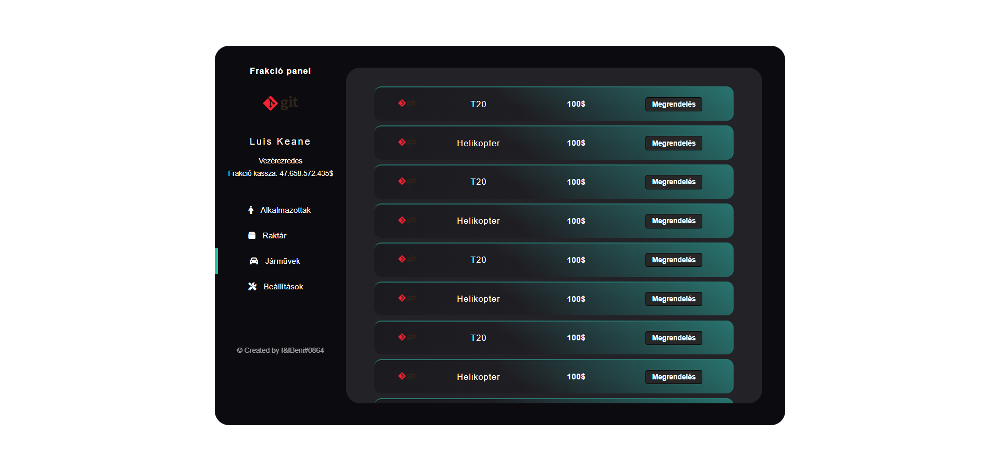

# faction-panel

## Project setup

```
npm install
```

### Compiles and hot-reloads for development

```
npm run serve
```

### Compiles and minifies for production

```
npm run build
```

### Pictures about the project:






### Customize configuration

See [Configuration Reference](https://cli.vuejs.org/config/).
